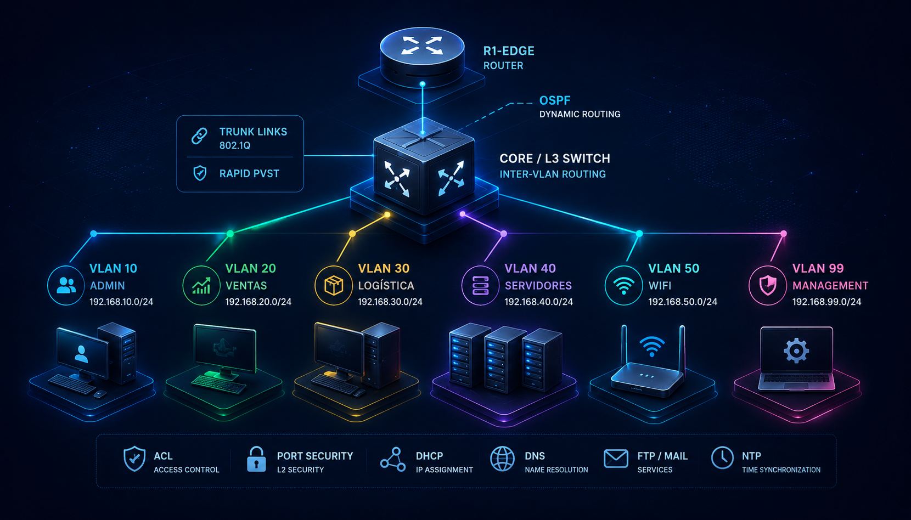

# 🌐 Enterprise Network Infrastructure

Proyecto de infraestructura de red empresarial desarrollado para diseñar, implementar y validar una arquitectura jerárquica utilizando Cisco Packet Tracer.

El proyecto integra segmentación de red, switching, routing dinámico, redundancia, servicios de red y controles básicos de seguridad.

## 🎯 Objetivo

Diseñar una infraestructura empresarial organizada y escalable que permita:

- Segmentar la red mediante VLANs.
- Implementar routing inter-VLAN.
- Utilizar OSPF para routing dinámico.
- Implementar EtherChannel para redundancia y disponibilidad.
- Aplicar STP para prevención de bucles.
- Configurar ACLs para control de tráfico.
- Implementar DHCP y DNS.
- Integrar infraestructura inalámbrica.
- Aplicar principios básicos de seguridad de red.

## 🏗️ Arquitectura

El diseño utiliza una arquitectura jerárquica compuesta por:

